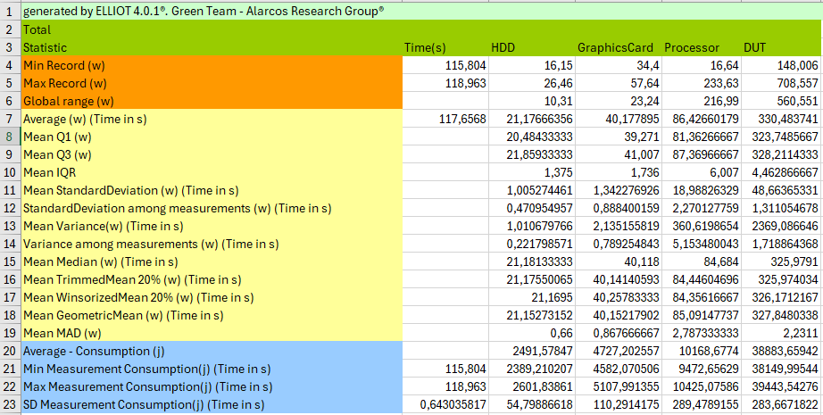
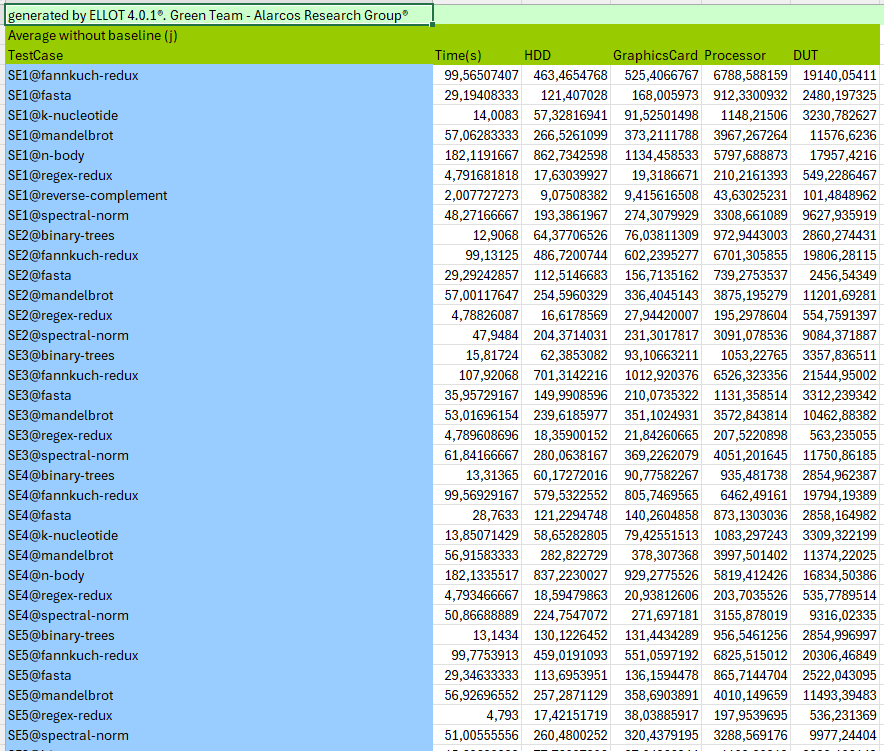
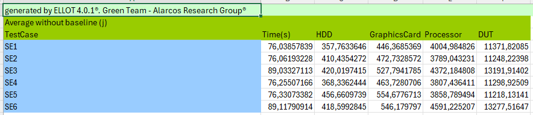
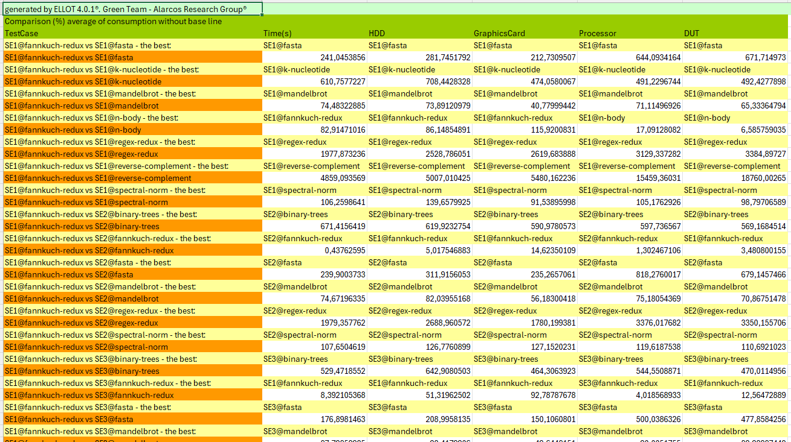

# Empirical Analysis of Python’s Energy Impact: Evidence from Real Measurements.
[Elisa Jiménez](https://orcid.org/0000-0002-2158-037X)

[Alberto Gordillo](https://orcid.org/0000-0002-4742-173X)  

[Coral Calero](https://orcid.org/0000-0003-0728-4176)

[Mª Ángeles Moraga](https://orcid.org/0000-0001-9165-7144)

[Félix García](https://orcid.org/0000-0001-6460-0353)


## Abstract
Background: Programming languages provide the notation for writing computer programs capable of granting our devices the desired functionalities. Even though they may seem intangible, the resulting programs involve an amount of energy consumption, which has an impact on the environment. Some studies on the consumption of programming languages indicate that while being one of the most widely used languages, Python is also one of the most demanding in terms of energy consumption.
Aims: To provide developers using Python with a set of best practices on how to use it in the most energy-efficient way, this paper presents a study on whether the different ways of programming in Python have an impact on the energy consumption of the resulting programs.
Method: We have studied the relationship between Python’s energy consumption and the fact that Python is a very versatile language that allows programs to be compiled and executed in many different ways.
Results: From the results obtained in our study, there seems to be a clear relationship between software energy consumption at runtime and: (1) the use of interpreted or compiled Python; (2) the use of dynamically or statically typed variables.
Conclusions: Compiling Python code is a good option if it is done using the py compile module. The use of interpreted code seems to improve energy consumption over compiling using Nuitka. The use of dynamically typed variables seems to improve
considerably the graphics and processor energy consumption. In addition, we have observed that energy consumption is not always directly related to execution time. Sometimes, more power in less time increases consumption, due to the power required.

## What is this?

This repository contains the source code of 10 algorithms implemented in Python programming languages, which were obtained from [Computer Language Benchmark Game](https://benchmarksgame-team.pages.debian.net/benchmarksgame/).
The repository also includes the resulting empirical results and some samples of the energy logs obtained from the hardware measuring instrument used in the study.

## How is structured?

This folder contains three main folders: code, empirical results and sample logs.

## Code Folder

The code folder contains 14 subfolders, one for each programming language, and a gen-input file to generate the input files needed to run some algorithms. It is structured as follows:

```Java

| <SE1>
	| <algorithm-1>
		| <source>
		| Makefile
	| ...
	| <algorithm-i>
		| <source>
		| Makefile
| ...
| <SEi>
	| <algorithm-1>
	| ...
	| <algorithm-i>


```

Taking the `SE1` software entity as an example, this is how the folder for the `binary-trees` algorithm would look like:

```Java

| SE1
	| binary-trees
		| binarytrees.gcc-3.c
		| Makefile
	| ...

```

#### The Operations

Each algorithm sub-folder, included in a programming language folder, contains a `Makefile`.
TThis is the file which shows how to perform the 2 main operations: *(1)* **compilation** and *(2)* **execution**.

Basically, each `Makefile` **must** contain 1 rule:

| Rule | Description |
| -------- | -------- |
| `run` | This rule specifies how the algorithm should be executed; It is used to test whether the algorithm runs with no errors and the output is the expected. 

To illustrate this, an example of the `Makefile` for the `binary-trees` algorithm in the `SE1` is:

```Makefile

run:
	python3.11 -OO binarytrees.cpython-311.py 21

```
## Empirical Results Folder

The empirical results folder includes all the information on the analysis of the energy consumption of the software. The basic terminology used is as follows:
- An entity class corresponds to a programming language. 
- The test case is an algorithm implemented in a determined programming language.
- Measurement is each of the executions of a testcase.

It is structured as follows:

|<report>
	| <EntityClass-1>@<Algorithm-1>.xls
	| ...
	| <EntityClass-i>@<Algorithm-i>.xls
	| testcases_total.xls
	| testcases_comparison.xls
	| versions_total.xls
	| versions_comparison.xls
	| 
	| <clustering>
		| ...
		| <byalgoritms>
			| <source>
			| Makefile
		|
		| <bylanguage>
			| <source>
			| Makefile
        	|ClustersByLanguageAlgorithm.xls
        	|scriptR.txt
	| 
	| 
		| <EntityClass-1>@<Algorithm>_<Device-1>.png
		| ...
		| <EntityClass-i>@<Algorithm>_<Device-i>.png
		|
		| <EntityClass-1>@<Algorithm>_dut-1.png
		| ...
		| <EntityClass-i>@<Algorithm>_dut-i.png
|<comparisons>
	| <byParadigm>
		| ...
	| <byType>
		| ...

### Report Folder
The report folder contains 84 Excel files containing the analysis data. One for each test case named `<EntityClass>@<Algorithm>`. It also contains two files "testcases_total" and "versions_total" with the summary of the test case and version information respectively.
As an example, the following images show the information of a test case.

The first image shows all the information of a measurement.


The second image shows all the information of a test case.


To facilitate the comparison of information, the file "testcases_total" contains one sheet for each statistical value of all test cases. These statistical values are:
Consumption average without baseline, Consumption median without baseline, Consumption average (with baseline), Consumption median (with baseline), Baseline, Power min, Power average without baseline, Power average (with baseline), Power median without baseline, Power median (with baseline), Trimmed mean to 20%, Winsorized mean to 20%, Geometric mean, Mean standard deviation, Mean variance, Standard deviation among measurments and Variance among measurments



In the same way as the "testcase_total" document, the "versions_total" document contains the statistical values for each Entity Class.



Finally, the validation tests of the statistics can be found in testcases_comparison and versions-comparison. It contains the Kolmogorov-Smirnov and Mann-Whitney tests for all comparisons of time, power and consumption.



#### Img folder
The img folder contains the graphs of the overall consumption in the execution of each measurement performed. It also includes the box plots of each device for each test case.

### Comparisons folder
This folder contains the ranking tables by type and paradigm. This information has been obtained from the data in the versions_total file.

### Experimental-package folder
It contains the results of the experimental measurements performed on Numba and GraalPy. For the algorithms that could not be measured on GraalPy, the folder contains the errors. 
These measurements were finally not included in the study.

It is structured as follows:
Inside the folder, there is a folder for Numba and a folder for GraalPy.
The Numba folder contains the results of measurements performed on a different version of the Mandelbrot algorithm. This algorithm was measured on Numba, Nuitka and the Python interpreter, with STV and with DTV.

On the other hand, the GraalPy folder contains two folders (STV and DTV). Inside these folders are the results for each of the measured algorithms.
```
|<TestCase>
	| Numba
		| <Code>
		| <Results>
	| GraalPy
		| <Code>
			| <DTV>
			| <STV>
		| <Results>
			| <DTV>
				|<Algorithm>
					| DTV@algorithm.xls
					| testcases_comparison.xls
					| versions_total.xls
					| versions_comparison.xls
			| <STV>

```


### Sample Logs Folder
This folder contains an example of a log, to illustrate the raw data generated by the EET measurement instrument. 
- The json file contains the measurement information of the test case binary-trees in SE1.
- Each line of 3PythonS11_794_EX are the values obtained for id, time, monitor and DUT
- Each line of 3PythonS11_794_IN are the values obtained for id, time, HDD(),HDD(2), Graphics card(1), Graphics card(2),Processor(1) and Processor(2).
DUT hardware components have two values because they have two sensors connected, the result of the DUT hardware component is the sum of the two values.

Note: The rest of the logs of this study are not included in the repository for practical reasons, due to their large size.

## Contacts and References

[Green Team Alarcos](https://greenteamalarcos.uclm.es/)

[The Computer Language Benchmark Game](https://benchmarksgame-team.pages.debian.net/benchmarksgame/)

